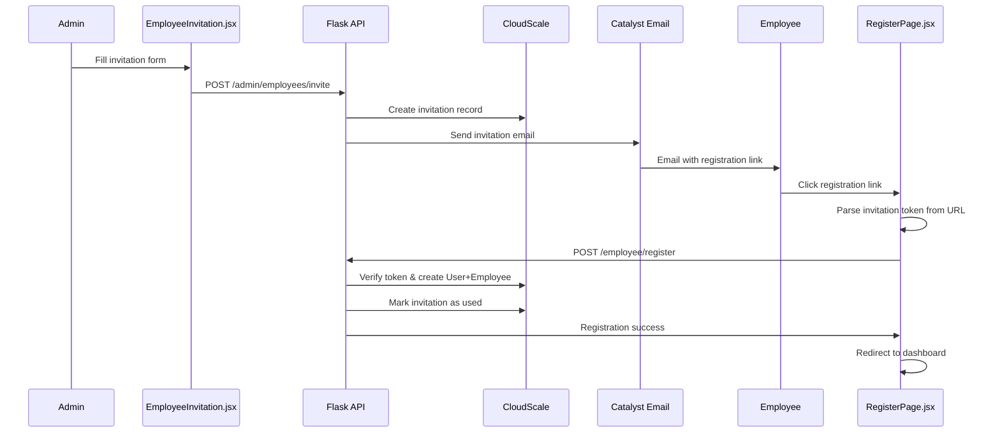

# Employee Invitation System - Technical Documentation

> **Last Updated:** December 18, 2024  
> **Status:** ✅ Implemented  
> **Module:** Admin / Employee Management

## 📋 Executive Summary
The Employee Invitation System enables administrators to invite new employees to the Smart Railway platform. The system uses secure tokens, email verification, and a multi-step registration process with role-based access control. Admins can invite employees with specific roles (Admin/Employee) and pre-fill department/designation information.

## 🏗️ Architecture Overview
```
Admin UI (React) → Flask API → CloudScale DB → Email Service
      ↓                ↓              ↓            ↓
EmployeeInvitation.jsx  Routes   Employee_Invitations  Catalyst
RegisterPage.jsx        Service      Sessions        Email API
```

**Flow:**
1. Admin creates invitation via UI form
2. System generates secure token & stores invitation
3. Email sent with registration link containing token
4. Employee clicks link, registers with pre-filled data
5. Registration creates User + Employee records
6. Invitation marked as "used" upon completion

## 📁 File Structure

### Frontend Components
```
railway-app/src/
├── pages/admin/
│   └── EmployeeInvitation.jsx       # Admin invitation management UI
├── pages/auth/
│   └── RegisterPage.jsx             # Employee registration with token
├── context/
│   └── SessionAuthContext.jsx      # Authentication context
└── services/
    └── sessionApi.js                # API client with CSRF
```

### Backend Components  
```
functions/smart_railway_app_function/
├── routes/
│   └── employee_invitation_routes.py    # REST API endpoints
├── services/
│   ├── employee_invitation_service.py   # Business logic & email
│   └── employee_service.py              # Employee CRUD operations
└── repositories/
    └── cloudscale_repository.py         # Database operations
```

## 🗄️ Database Schema

### Employee_Invitations Table
| Field | Type | Required | Unique | Description |
|-------|------|----------|--------|-------------|
| ID | BIGINT | PK | Yes | Auto-generated record ID (ROWID) |
| Invitation_Token | VARCHAR(255) | Yes | Yes | Secure invitation token (URL-safe) |
| Email | VARCHAR(255) | Yes | - | Invitee email (lowercase) |
| Role | ENUM | Yes | - | 'Admin' \| 'Employee' - role to assign |
| Department | VARCHAR(50) | - | - | Pre-fill for registration |
| Designation | VARCHAR(50) | - | - | Pre-fill for registration |
| Invited_By | BIGINT | Yes | - | Admin ID (→ Employees.ROWID) |
| Invited_At | DATETIME | Yes | - | Invitation creation time |
| Expires_At | DATETIME | Yes | - | Expiration timestamp (24h default) |
| Is_Used | VARCHAR(10) | Yes | - | 'true' \| 'false' |
| Used_At | DATETIME | - | - | When invitation was used |
| Registered_Employee_Id | BIGINT | - | - | New employee record (→ Employees.ROWID) |
| Created_At | DATETIME | Yes | - | Timestamp used for sorting |

### Related Tables
- **Employees**: Admin creating invitation & newly registered employee
- **Users**: User account created during registration
- **Sessions**: Session management for authenticated users

**Relationships:**
- `Employees` → `Employee_Invitations` (1:N) - Admin invites employees
- `Employee_Invitations` → `Employees` (1:1) - Invitation creates employee
- `Employee_Invitations` → `Users` (1:1) - Registration creates user account

## 🔌 API Endpoints

### 1. POST /admin/employees/invite
**Create employee invitation**

**Request:**
```json
{
  "email": "employee@example.com",
  "role": "Employee",
  "department": "Operations", 
  "designation": "Station Manager"
}
```

**Response (201):**
```json
{
  "status": "success",
  "message": "Employee invitation sent successfully",
  "data": {
    "invitation_id": "123",
    "email": "employee@example.com", 
    "expires_at": "2026-04-10T13:43:35.426Z",
    "registration_link": "https://domain.com/app/#/employee-register?invitation=abc123"
  }
}
```

**Validation:**
- Email format validation
- Duplicate email check (both Employees & Users tables)
- Admin authentication required
- Department & Designation required

### 2. GET /admin/employees/invitations
**List employee invitations**

**Query Parameters:**
- `limit`: Max results (default 50, max 100)

**Response (200):**
```json
{
  "status": "success",
  "data": {
    "invitations": [
      {
        "id": "123",
        "email": "employee@example.com",
        "role": "Employee",
        "department": "Operations",
        "designation": "Station Manager",
        "invited_at": "2026-04-03T13:43:35.426Z",
        "expires_at": "2026-04-10T13:43:35.426Z",
        "is_used": false,
        "used_at": null,
        "invited_by": "456"
      }
    ],
    "total": 1
  }
}
```

### 3. POST /admin/employees/invitations/{id}/refresh
**Refresh invitation expiry and resend email**

**Response (200):**
```json
{
  "status": "success",
  "message": "Invitation refreshed successfully",
  "data": {
    "invitation_id": "123",
    "email": "employee@example.com",
    "expires_at": "2026-04-11T14:30:00.000Z"
  }
}
```

### 4. POST /admin/employees/invitations/{id}/reinvite
**Generate new token and resend invitation**

**Response (200):**
```json
{
  "status": "success", 
  "message": "Employee reinvited successfully",
  "data": {
    "invitation_id": "123",
    "email": "employee@example.com",
    "expires_at": "2026-04-11T14:30:00.000Z"
  }
}
```

### 5. POST /employee/register
**Register employee using invitation token**

**Request:**
```json
{
  "invitation": "secure-token-here",
  "fullName": "Jane Doe",
  "password": "StrongPassword123!",
  "phoneNumber": "+91-9876543210"
}
```

**Response (201):**
```json
{
  "status": "success",
  "message": "Employee account created successfully",
  "data": {
    "employee_id": "EMP001",
    "user_id": "789",
    "role": "Employee"
  }
}
```

**Validation:**
- Token verification & expiry check
- Password strength (min 8 chars)
- Duplicate account prevention
- Creates both User & Employee records atomically

## 🔄 Registration Flow



**Step-by-step Process:**
1. **Invitation Creation**: Admin fills form → API validates → DB stores invitation → Email sent
2. **Token Verification**: Employee clicks link → Token extracted from URL → API validates token
3. **Registration**: Employee fills form → API creates User & Employee records → Invitation marked used
4. **Authentication**: User automatically logged in → Redirected to appropriate dashboard

## 🎨 Frontend Components

### EmployeeInvitation.jsx
**Purpose**: Admin interface for managing employee invitations

**Key Features:**
- Invitation form with role/department/designation
- Statistics cards (Total, Pending, Expired, Accepted)
- Invitation list with status badges
- Refresh/Reinvite functionality
- Real-time status updates

**State Management:**
```jsx
const [formData, setFormData] = useState({
  email: "",
  role: "Employee", 
  department: "",
  designation: "",
});
const [invitations, setInvitations] = useState([]);
const [loading, setLoading] = useState(false);
```

**Status Badge Logic:**
- **Confirmed** (Green): `invitation.used_at` exists
- **Cancelled** (Red): Expired and not used
- **Pending** (Yellow): Active and not expired

### RegisterPage.jsx  
**Purpose**: Employee registration with invitation token handling

**Key Features:**
- URL parameter parsing for invitation token
- Pre-filled email from invitation
- Password validation & confirmation
- Employee vs User registration detection
- Error handling for invalid tokens

**Token Handling:**
```jsx
const [searchParams] = useSearchParams();
const invitationToken = searchParams.get('invitation');
const isEmployeeInvitation = !!invitationToken;
```

**Registration Logic:**
```jsx
if (invitationToken) {
  registrationData.invitationToken = invitationToken;
  registrationData.type = 'employee';
}
```

## 📧 Email Template

### HTML Email Structure
**Template**: `build_invitation_email()` in `employee_invitation_service.py`

**Components:**
- **Header**: Gradient banner with app name
- **Content**: Welcome message with role details
- **CTA Button**: Registration link with secure token
- **Information Box**: Next steps for employee
- **Footer**: Expiry notice & contact info

**Dynamic Elements:**
```python
role_details = f"<li><strong>Role:</strong> {role}</li>"
if department:
    role_details += f"<li><strong>Department:</strong> {department}</li>"
if designation:
    role_details += f"<li><strong>Designation:</strong> {designation}</li>"
```

**Registration URL Format:**
```
https://domain.com/app/index.html#/employee-register?invitation={token}
```

## 🔐 Security Implementation

### Token Generation
```python
def generate_invitation_token() -> str:
    """Generate a secure invitation token (URL-safe)."""
    return secrets.token_urlsafe(32)  # 256 bits of entropy
```

**Security Features:**
- **Cryptographically secure** random tokens (256-bit entropy)
- **URL-safe** encoding for email links
- **Time-based expiry** (24 hours default)
- **Single-use tokens** (marked as used after registration)

### Route Protection
- **Admin-only endpoints**: `@require_session_admin` decorator
- **CSRF protection**: Required for state-changing requests
- **Session validation**: HttpOnly cookies with server-side verification

### Validation Rules
- **Email uniqueness**: Checked against both Users & Employees tables
- **Token verification**: Validates token existence, expiry, and usage status
- **Password strength**: Minimum 8 characters required
- **Role validation**: Limited to 'Admin' or 'Employee' only

### Data Sanitization
```python
# Safe ZCQL queries using parameter escaping
email_safe = employee_email.lower().strip().replace("'", "''")
query = f"SELECT ROWID FROM {TABLES['employee_invitations']} WHERE Email = '{email_safe}'"
```

## ⚙️ Configuration

### Environment Variables
```bash
# Invitation Configuration
INVITATION_EXPIRY_HOURS=24          # Token expiry time
BASE_URL=https://your-domain.com    # For registration links

# Email Configuration  
FROM_EMAIL=noreply@railway.com      # Sender email
APP_NAME=Smart Railway              # Application name
```

### Service Configuration
```python
# Default expiry
INVITATION_EXPIRY_HOURS = int(os.getenv('INVITATION_EXPIRY_HOURS', '24'))

# Email service
FROM_EMAIL = "Smart Railway <noreply@railway.com>"
APP_NAME = "Smart Railway Ticketing System"
```

### Table Configuration (config.py)
```python
TABLES = {
    'employee_invitations': 'Employee_Invitations',
    'employees': 'Employees', 
    'users': 'Users'
}
```

## ✅ Implementation Status

### ✅ Implemented Features
- [x] Admin invitation creation with role/department/designation
- [x] Secure token generation (256-bit entropy)
- [x] HTML email templates with registration links
- [x] Employee registration from invitation tokens
- [x] Invitation status tracking (pending/expired/used)
- [x] Refresh expired invitations (extend expiry)
- [x] Reinvite with new tokens
- [x] Atomic User + Employee account creation
- [x] Duplicate email prevention across all tables
- [x] Admin dashboard with statistics and invitation list
- [x] Token expiry validation
- [x] CSRF protection for state-changing operations

### ❌ Not Implemented Features
- [ ] Invitation cancellation (DELETE endpoint returns 501)
- [ ] Bulk invitation import from CSV
- [ ] Email template customization via admin UI
- [ ] Invitation history/audit trail
- [ ] Notification preferences for admins
- [ ] Employee profile photo upload during registration

### 🔄 Future Improvements
- **Invitation Templates**: Admin-configurable email templates
- **Department Management**: Dynamic department/designation lists
- **Bulk Operations**: CSV import for multiple invitations
- **Advanced Filtering**: Search/filter invitations by status/date/role
- **Invitation Reminders**: Automated reminder emails for pending invitations
- **Analytics Dashboard**: Invitation metrics and success rates

## 🧪 Testing Guide

### Manual Testing Steps

#### 1. Create Invitation
```bash
curl -X POST "http://localhost:3000/server/smart_railway_app_function/admin/employees/invite" \
  -H "Content-Type: application/json" \
  -H "Cookie: session_id=your-session-cookie" \
  -d '{
    "email": "test@example.com",
    "role": "Employee",
    "department": "Operations",
    "designation": "Station Manager"
  }'
```

**Expected**: 201 with invitation data & registration link

#### 2. List Invitations  
```bash
curl -X GET "http://localhost:3000/server/smart_railway_app_function/admin/employees/invitations" \
  -H "Cookie: session_id=your-session-cookie"
```

**Expected**: 200 with invitations array

#### 3. Register with Token
```bash  
curl -X POST "http://localhost:3000/server/smart_railway_app_function/employee/register" \
  -H "Content-Type: application/json" \
  -d '{
    "invitation": "secure-token-from-email",
    "fullName": "Test Employee", 
    "password": "TestPass123!",
    "phoneNumber": "+91-9876543210"
  }'
```

**Expected**: 201 with employee account created

#### 4. Verify Registration
```bash
curl -X POST "http://localhost:3000/server/smart_railway_app_function/session/employee/login" \
  -H "Content-Type: application/json" \
  -d '{
    "email": "test@example.com",
    "password": "TestPass123!"
  }'
```

**Expected**: 200 with session created

### Test Cases

| Test Case | Description | Expected Result |
|-----------|-------------|----------------|
| **TC-001** | Create invitation with valid data | 201, invitation created |
| **TC-002** | Create invitation with duplicate email | 400, error message |
| **TC-003** | Create invitation without department | 400, validation error |
| **TC-004** | Register with valid token | 201, accounts created |
| **TC-005** | Register with expired token | 400, token expired error |
| **TC-006** | Register with used token | 400, token already used error |
| **TC-007** | Register with invalid token | 400, invalid token error |
| **TC-008** | Refresh expired invitation | 200, new expiry set |
| **TC-009** | Reinvite with new token | 200, new token generated |
| **TC-010** | List invitations as admin | 200, invitations array |

### Error Scenarios
- **Invalid email format**: "Please enter a valid email address"
- **Duplicate employee**: "Employee with this email already exists" 
- **Duplicate user**: "A user (passenger) with this email already exists"
- **Token expired**: "Invitation is invalid or expired"
- **Token used**: "Invitation already used"
- **Weak password**: "Password must be at least 8 characters"
- **Missing fields**: "Department is required" / "Designation is required"

---

## 📚 Related Documentation
- [CLOUDSCALE_DATABASE_SCHEMA_V2.md](../architecture/CLOUDSCALE_DATABASE_SCHEMA_V2.md) - Database schema
- [SECURITY_IMPLEMENTATION_SUMMARY.md](../security/SECURITY_IMPLEMENTATION_SUMMARY.md) - Security overview  
- [AGENTS_GUIDE.md](../AGENTS_GUIDE.md) - Development workflow
- [ROUTING_GUIDE.md](../architecture/ROUTING_GUIDE.md) - URL routing standards

---

**Document Version:** 1.0  
**Authors:** Smart Railway Development Team  
**Review Date:** Every sprint cycle